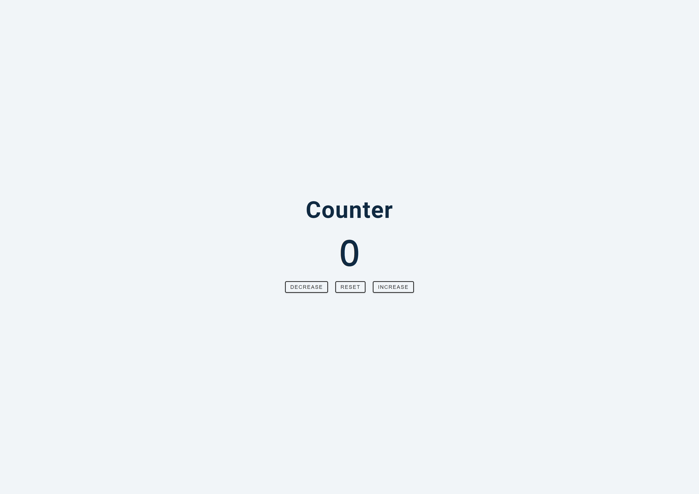
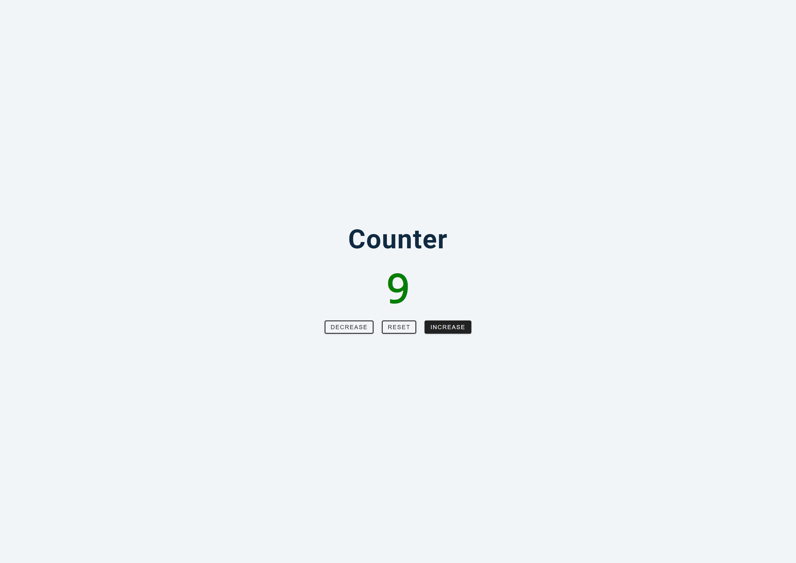
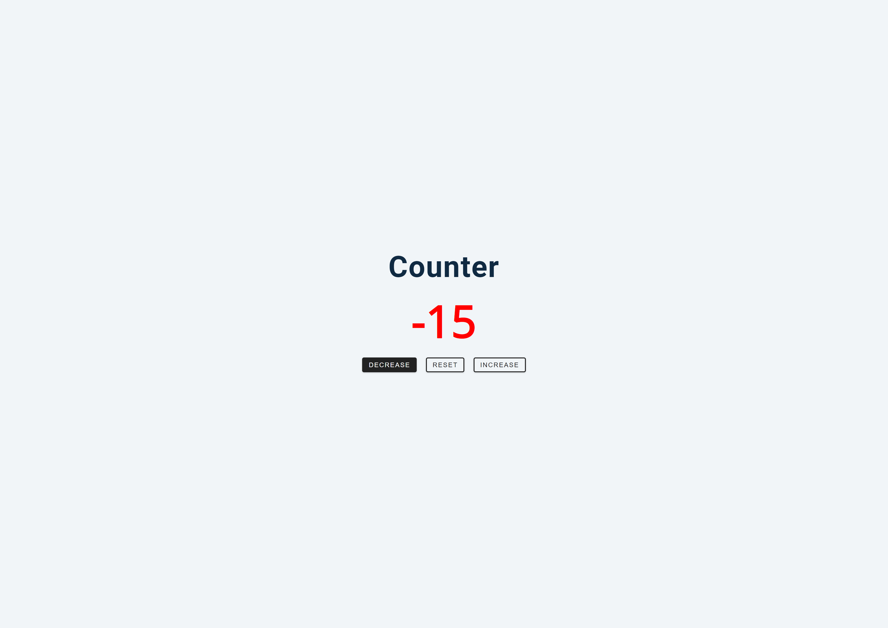

## Table of contents

- [Overview](#overview)
  - [The challenge](#the-challenge)
  - [Screenshot](#screenshot)
  - [Links](#links)
- [My process](#my-process)
  - [Built with](#built-with)
  - [What I learned](#what-i-learned)

## Overview

### The challenge

- Build a simple counter where in the count can be increased, decreased or resetted. The color changes based on the positive or negative number displayed.

### Screenshot

### Links

- Solution URL: [https://github.com/NandodkarAmogh/Counter](https://github.com/NandodkarAmogh/Counter)
- Live Site URL: [https://simple-javascript-counter.netlify.app/](https://simple-javascript-counter.netlify.app/)

## My process

### Built with

- HTML
- CSS custom properties
- Vanilla JavaScript

### What I learned

Through this project I learned 
- document.querySelectorAll()
- forEach()
- addEventListener()
- currentTarget property
- classList
- textContent

